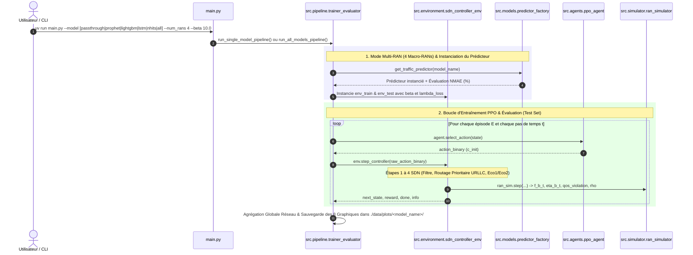

# 5G/6G RAN Network Slicing Simulator & PPO Agent

Ce projet implémente un environnement de simulation de réseau d'accès radio orienté **Network Slicing 5G/6G** couplé à un agent **Reinforcement Learning (PPO - Proximal Policy Optimization)** et une **Architecture SDN à Double Contrôleur**.

L'objectif est d'optimiser l'efficacité énergétique des stations de base (RAN) tout en garantissant la Qualité de Service (QoS) des utilisateurs en s'appuyant sur l'activation/désactivation dynamique des slices, la prédiction du trafic et la redirection intelligente vers un **EcoSlice**.

---

## 🚀 Fonctionnalités Principales & Contributions du PFE

- **Modèle Mathématique Énergétique 5G/6G (Phyu et al., 2023)** :
  - Puissance statique ($P_{\text{static}} = 18\text{W}$), fixe par slice ($P_{\text{fixed}} = 139\text{W}$) et dynamique dépendant de la charge ($P_{\text{dynamic}} = 742\text{W}$).
  - Facteurs d'impact énergétique par tranche $\psi_i$ (`URLLC`, `mMTC`, `eMBB`, `URLLC_eMBB_MIX`, `Eco`).
  - Extinction physique réelle : quand une tranche est désactivée ($c_i=0$), sa consommation fixe et dynamique tombe à **0 Watt**.

- **Modèle QoS & Délais SLA par Numérologie 5G Active** :
  - **Exigences SLA ($d_u$)** : URLLC (1.0 ms), URLLC_eMBB_MIX (5.0 ms), eMBB (10.0 ms), mMTC (20.0 ms).
  - **Latences Actives ($d_{\text{active}}$)** : URLLC (0.8 ms), MIX (4.0 ms), eMBB (8.0 ms), mMTC (15.0 ms).
  - **Délais d'Extinction (EcoSlice 1)** : Redirection avec latence fixe de **11.0 ms**.
  - Suivi normalisé du ratio de latence ($\text{Latence} / \text{SLA}$) avec seuil de conformité à **1.0 (Figure 4b)**.

- **Prédictions Supervisées Multi-Modèles de Trafic Futur** :
  - **PROPHET (Meta/Facebook)** : Modèle de série temporelle additif avec `growth='flat'`, entraîné indépendamment par couple `(slice, station_id)`. **Top 1 Précision (NMAE = 0.54%)** sans biais d'extrapolation sur les 7 mois d'écart.
  - **LIGHTGBM Predictor** : Modèle GBDT ultra-rapide avec lags temporels (10 min, 1h, 24h, 7 jours) et features calendaires. **Meilleur compromis temps réel (NMAE = 0.66%)**.
  - **PyTorch LSTM** : Réseau récurrent pour la captation séquentielle des dépendances temporelles.
  - **PyTorch N-HiTS** : Architecture neuronale hiérarchique multi-échelle.
  - **Passthrough (Oracle/Naive)** : Baseline d'évaluation de la réallocation dynamique pure ($l^{t+1} = l^t$).

- **Support Multi-RAN & Regroupement Spatial (`--num_rans K`)** :
  - Regroupement des 69 subnets en $K$ Macro-RANs équitables (via découpage par quantiles).
  - Accélère l'entraînement PPO de 17x tout en conservant 100% du trafic réseau global.

- **Cadre Expérimental à 4 Régimes & Frontière de Pareto** :
  - **Expérience 1 (Équilibré Standard : $\beta=10, \lambda=50$)** : Compromis nominal (Gain ~24.6%, QoS ~79-95%).
  - **Expérience 2 (Sobriété Extrême : $\beta=2, \lambda=10$)** : Gain d'énergie maximal (**29.49%**).
  - **Expérience 3 (Haute Priorité SLA : $\beta=35, \lambda=100$)** : Satisfaction QoS maximale (**94.98%**).
  - **Expérience 4 (Anti-Surcharge Sécurisé : $\beta=10, \lambda=200$)** : Élimination totale des débordements $L_t$.
  - Génération automatique de la **Frontière de Pareto** (`pareto_energy_vs_qos.png`).

- **Rapports d'Analyse HTML Avancés** :
  - **[rapport_final_pfe_5g6g.html](file:///home/cytech/Ing3/PFE/dataset_creation/rapport_final_pfe_5g6g.html)** : Rapport master complet avec équations MDP/RL, justification des hyperparamètres, décryptage des 8 figures et guide de soutenance oral.

---

## 🔄 Flux d'Exécution & Chaîne d'Appels des Fonctions



---

## 📁 Structure Modulaire du Projet

```
.
├── main.py                          # Point d'entrée CLI principal (--model, --num_rans, --steps, --episodes, --beta, --lambda_loss)
├── pyproject.toml                   # Fichier de dépendances Python / uv (pandas, numpy<2, torch, prophet, lightgbm, etc.)
├── README.md                        # Documentation du projet PFE
├── rapport_final_pfe_5g6g.html       # Rapport Master HTML complet
├── data/
│   ├── experiments/                 # Archives sécurisées des 4 régimes expérimentaux
│   │   ├── beta10_lambda50/         # 📂 Expérience 1 (Équilibré)
│   │   ├── exp2_beta2_lambda10/     # 📂 Expérience 2 (Sobriété Extrême)
│   │   ├── exp3_beta35_lambda100/   # 📂 Expérience 3 (Haute Priorité SLA)
│   │   └── exp4_beta10_lambda200/   # 📂 Expérience 4 (Anti-Surcharge)
│   └── plots/                       # Répertoire courant des graphiques générés
│       ├── pareto_energy_vs_qos.png # 📈 Frontière de Pareto globale
│       ├── prophet/                 # 📂 Graphiques du modèle Prophet
│       ├── lightgbm/                # 📂 Graphiques du modèle LightGBM
│       ├── lstm/                    # 📂 Graphiques du modèle PyTorch LSTM
│       ├── nhits/                   # 📂 Graphiques du modèle PyTorch N-HiTS
│       ├── passthrough/             # 📂 Graphiques du mode Passthrough / Oracle
│       └── 7_benchmark_all_models.png # 📊 Benchmark comparatif général
└── src/
    ├── simulator/
    │   └── ran_simulator.py         # Moteur physique et énergétique 5G/6G (Phyu et al., 2023)
    ├── environment/
    │   └── sdn_controller_env.py    # Environnement SDN à Double Contrôleur (Algorithmes 1 à 4)
    ├── agents/
    │   └── ppo_agent.py             # Agent Apprentissage par Renforcement PPO (PyTorch Multi-Binaire)
    ├── models/
    │   ├── base_predictor.py        # Interface abstraite (NMAE %, MAE, RMSE)
    │   ├── prophet_predictor.py     # Predictor Prophet avec growth='flat' par (slice, station_id)
    │   ├── lightgbm_predictor.py    # LightGBM GBDT Predictor (Multi-lags + calendaires)
    │   ├── lstm_predictor.py      # PyTorch LSTM Predictor
    │   ├── nhits_predictor.py     # PyTorch N-HiTS Predictor
    │   ├── passthrough_predictor.py # Oracle / Naive passthrough
    │   └── predictor_factory.py   # Factory usine à modèles
    ├── pipeline/
    │   └── trainer_evaluator.py     # Orchestrateur Train/Test 80/20 & Benchmark 'all'
    └── visualization/
        ├── plot_generator.py      # Générateur des 8 figures épurées
        └── generate_pareto.py     # Générateur du graphique de la Frontière de Pareto
```

---

## 💻 Utilisation & Commandes CLI (`uv run main.py`)

### Options CLI de `main.py`

| Argument | Description | Valeur par Défaut |
| :--- | :--- | :--- |
| `--model` | Modèle prédicteur (`passthrough`, `prophet`, `lightgbm`, `lstm`, `nhits`, `all`) | `passthrough` |
| `--num_rans` | Regroupement des 69 subnets en $K$ Macro-RANs (`0` = subnets bruts, `4` = 4 Macro-RANs) | `0` |
| `--subnet` | Choix spécifique de subnets (`all`, `top5`, `top10`, ou ID `0`, `109`) | `all` |
| `--steps` | Nombre max de pas de temps par épisode (`0` = dataset complet) | `0` (Complet) |
| `--episodes` | Nombre d'épisodes d'entraînement PPO | `1` |
| `--beta` | **Poids de la satisfaction QoS** dans la récompense PPO | `10.0` |
| `--lambda_loss` | **Pénalité de perte / surcharge** dans la récompense PPO | `50.0` |
| `--log_freq` | Fréquence d'affichage du suivi dans le terminal | `1000` |

---

### Exemples d'Exécution

```bash
# 1. Mode Par Défaut (LightGBM sur 4 Macro-RANs avec beta=10.0)
uv run main.py --model lightgbm --num_rans 4

# 2. Régime Sobriété Énergétique Extrême (beta = 2.0, lambda_loss = 10.0)
uv run main.py --model lightgbm --num_rans 4 --episodes 5 --beta 2.0 --lambda_loss 10.0

# 3. Régime Haute Priorité SLA (beta = 35.0, lambda_loss = 100.0)
uv run main.py --model lightgbm --num_rans 4 --episodes 5 --beta 35.0 --lambda_loss 100.0

# 4. BENCHMARK GLOBAL COMPARATIF DES 5 MODÈLES
uv run main.py --model all --num_rans 4 --episodes 5 --beta 10.0 --log_freq 20000

# 5. Régénération du Graphique de la Frontière de Pareto
uv run python3 src/visualization/generate_pareto.py
```

---

## 📊 Synthèse de la Frontière de Pareto (4 Régimes Expérimentaux)

| Expérience & Régime | Paramètres (β, λ) | Gain Énergétique Moyen (%) | Satisfaction QoS Moyenne (%) | Orientation Opérateur |
| :--- | :---: | :---: | :---: | :--- |
| **Exp 3 : Haute Priorité SLA** | $\beta = 35.0, \lambda = 100.0$ | 8.92 % | **94.98 %** | Garantie Absolue de Latence (URLLC/MIX) |
| **Exp 4 : Anti-Surcharge** | $\beta = 10.0, \lambda = 200.0$ | 14.64 % | 84.72 % | Sécurisation Anti-Débordement $L_t$ |
| **Exp 1 : Équilibré Standard** | $\beta = 10.0, \lambda = 50.0$ | 24.62 % | 79.06 % | Compromis Nominal Énergie / Service |
| **Exp 2 : Sobriété Extrême** | $\beta = 2.0, \lambda = 10.0$ | **29.49 %** | 82.92 % | Réduction Maximale Empreinte Carbone |
